<div align="center">



<br/>

# Zuhaib Rashid

### `Fullstack Developer` · `System Thinker` · `UI Perfectionist`

<br/>

<p align="center">
  <a href="https://www.zuhaibrashid.com/">
    
  </a>
  <a href="https://www.linkedin.com/in/zuhaib-rashid-661345318/">
    
  </a>
  <a href="https://x.com/xuhaib_x9">
    
  </a>
  <a href="mailto:your.email@example.com">
    
  </a>
</p>

*Building end-to-end, production-grade web applications — from database schema to pixel-perfect UI — with obsessive attention to performance, real-time systems, and developer experience.*

</div>

<br/><br/>

## ✦ Overview

I am a **Fullstack Developer** based in Kashmir, India. I architect and ship complete web applications — APIs, databases, real-time systems, and polished frontends — with a focus on scalability, type safety, and buttery-smooth user experiences.

- 🚀 Apps I've built are used by **400+ users** in production.
- 🧱 Fullstack expertise across the **MERN stack** (MongoDB, Express, React, Node.js).
- ⚛️ Deep knowledge of **React, Next.js**, and modern state management (**Zustand**, Redux).
- 🔌 Experience building **real-time features** with **Socket.io** and caching with **Redis**.
- 📊 Proficient with **TanStack Query & Table** for data-heavy, server-synced interfaces.
- 🎨 Passionate about **Motion Design** (Framer Motion, GSAP) and **TailwindCSS**.
- 🔒 Strong focus on **TypeScript** across the entire stack for end-to-end type safety.
- 🧠 Currently exploring **System Architecture**, **AI Integration**, and **DevOps**.

<br/>

## ✦ Technical Arsenal

<details open>
<summary><b>🎨 Frontend</b></summary>
<br/>
<p>
  
  
  
  
  
  
  
  
  
  
  
</p>
</details>

<details open>
<summary><b>⚙️ Backend & Database</b></summary>
<br/>
<p>
  
  
  
  
  
  
  
  
  
</p>
</details>

<details open>
<summary><b>📦 State Management & Data Fetching</b></summary>
<br/>
<p>
  
  
  
  
  
  
  
</p>
</details>

<details open>
<summary><b>🛠️ DevOps & Tools</b></summary>
<br/>
<p>
  
  
  
  
  
  
  
  
  
</p>
</details>

<br/><br/>

## ✦ What I Build With

```
 ┌─────────────────────────────────────────────────────────────────────┐
 │                         FULLSTACK WORKFLOW                         │
 ├──────────────────┬──────────────────┬───────────────────────────────┤
 │    FRONTEND      │    BACKEND       │    INFRA & DX                │
 │                  │                  │                              │
 │  React / Next.js │  Node / Express  │  Docker · Vercel             │
 │  TypeScript      │  MongoDB / PG    │  Redis · Socket.io           │
 │  TailwindCSS     │  Prisma / ODM    │  GitHub Actions              │
 │  Framer Motion   │  REST APIs       │  Vite · ESLint               │
 │  Zustand / RTK   │  Auth (JWT)      │  Postman · Figma             │
 │  TanStack Q / T  │  Redis Caching   │  Zod Validation              │
 └──────────────────┴──────────────────┴───────────────────────────────┘
```

<br/><br/>

## ✦ Selected Work

<table bordercolor="#30363d">
  <tr>
    <td width="50%" valign="top">
      <h3>🏥 Carepulse</h3>
      <p>Comprehensive Hospital Management System featuring real-time scheduling, patient tracking, role-based dashboards, and Socket.io powered live updates.</p>
      <p><code>React</code> <code>Node.js</code> <code>MongoDB</code> <code>Zustand</code> <code>Socket.io</code> <code>TailwindCSS</code></p>
      <a href="https://hms-seven-green.vercel.app/"></a>
      <a href="https://github.com/Zuhaib-dev/Carepulse"></a>
    </td>
    <td width="50%" valign="top">
      <h3>🌦️ Klimate</h3>
      <p>Advanced Weather Analytics Dashboard with interactive data visualizations, geolocation search, 5-day forecasts, and server-state caching.</p>
      <p><code>React</code> <code>TanStack Query</code> <code>Recharts</code> <code>TypeScript</code></p>
      <a href="https://kilamate.netlify.app/"></a>
      <a href="https://github.com/Zuhaib-dev/Kilamate"></a>
    </td>
  </tr>
  <tr>
    <td width="50%" valign="top">
      <h3>🤖 Resumind</h3>
      <p>AI-Powered Resume Analyzer providing intelligent feedback, semantic scoring, and actionable improvement suggestions powered by OpenAI.</p>
      <p><code>Next.js</code> <code>TypeScript</code> <code>OpenAI</code> <code>TailwindCSS</code></p>
      <a href="https://resumind-ebon.vercel.app/"></a>
      <a href="https://github.com/Zuhaib-dev/Resumind"></a>
    </td>
    <td width="50%" valign="top">
      <h3>🔭 More Coming Soon</h3>
      <p>I am continuously building and shipping. Always experimenting with new patterns, tools, and architectures. Check out my repos for the latest.</p>
      <br/>
      <a href="https://github.com/Zuhaib-dev?tab=repositories"></a>
    </td>
  </tr>
</table>

<br/><br/>

## ✦ Metrics & Activity

<div align="center">
  
  
</div>

<br/>

<div align="center">
  
</div>

<br/>

<div align="center">
  
</div>

<br/><br/>

---

<div align="center">
  <br/>
  <p><b>Open to fullstack roles, freelance projects, and interesting collaborations.</b></p>
  <p><i>Let's build something exceptional together.</i></p>
  
  <br/><br/>
</div>